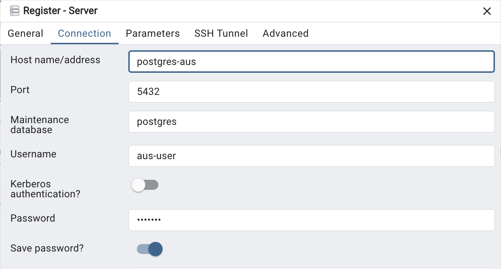

# Postgresql

Lancer votre BDD en local, avec Docker et Docker Compose.

## Lancement et initialisation des données

```sh
docker network create web
```

```sh
docker compose up -d
```

> Note: vous pouvez ignorer les warnings sur Mac M1/M2

```sh
# creates aus database
docker compose exec -it postgres-aus psql -U aus-user -d postgres -f /tmp/sql/create-database.sql
```

```sh
# creates the postgis postgreSQL extension
# for geo spatial data types
docker compose exec -it postgres-aus psql -U aus-user -d aus -f /tmp/sql/create-extension.sql
```

```sh
# creates aus tables
docker compose exec -it postgres-aus psql -U aus-user -d aus -f /tmp/sql/create-tables.sql
```

```sh
# loads data in tables from CSV files
docker compose exec -it postgres-aus psql -U aus-user -d aus -f /tmp/sql/load-data.sql
```

## Requêtez vos données avec pgadmin

- Depuis votre navigateur, allez à l'adresse localhost:5010/
- Connectez vous avec
  - login: prof@aus.floless.fr
  - mdp: aus2025
- Ajoutez la connection vers postgres

  - Click-droit sur `Servers` > `Register` > `Server`
  - `Name`: mettez `Local`
  - Dans le tab `Connection`:

    - `Host name / address`: postgres-aus
    - `port`: 5432
    - `user`: aus-user
    - `password`: aus2025

    

- sauvgarder

Vous devriez avoir accès aux tables de `aus` dans le schéma `public`
